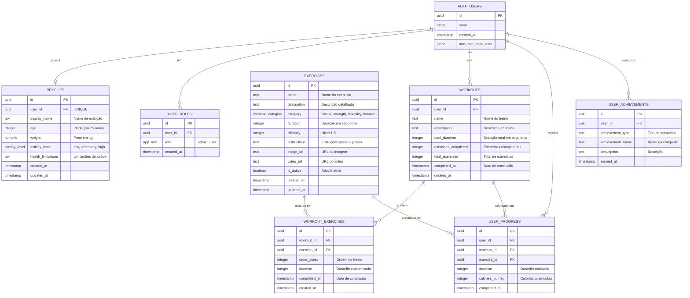

# Diagrama de Entidade-Relacionamento - VivaFit Seniors

## Modelo Conceitual do Banco de Dados



---

## Descrição das Entidades

### 1. **AUTH_USERS** (Sistema Supabase)
Tabela gerenciada pelo Supabase Auth para autenticação de usuários.

**Relacionamentos:**
- 1:1 com `PROFILES` (cada usuário tem um perfil único)
- 1:N com `USER_ROLES` (um usuário pode ter múltiplos papéis)
- 1:N com `WORKOUTS` (um usuário cria múltiplos treinos)
- 1:N com `USER_PROGRESS` (um usuário registra múltiplos progressos)
- 1:N com `USER_ACHIEVEMENTS` (um usuário conquista múltiplas conquistas)

---

### 2. **PROFILES**
Armazena informações personalizadas do perfil do usuário idoso.

**Campos principais:**
- `user_id` (FK UNIQUE): Chave estrangeira única para `auth.users`
- `display_name`: Nome de exibição do usuário
- `age`: Idade (público-alvo: 50-75 anos)
- `weight`: Peso corporal em kg
- `activity_level`: Nível de atividade (low, sedentary, high)
- `health_limitations`: Restrições de saúde (ex: "Dores no joelho e na coluna")

**Relacionamento:** 1:1 com `AUTH_USERS`

**Segurança RLS:**
```sql
user_id = auth.uid()
```

---

### 3. **USER_ROLES**
Controla permissões e papéis dos usuários no sistema.

**Campos principais:**
- `role`: Papel do usuário (admin, user)
- Constraint UNIQUE (user_id, role) para evitar duplicação

**Relacionamento:** N:1 com `AUTH_USERS`

**Uso:** Políticas RLS verificam se o usuário tem role 'admin' para operações administrativas.

---

### 4. **EXERCISES**
Catálogo de exercícios disponíveis para idosos.

**Campos principais:**
- `name`: Nome do exercício (ex: "Caminhada no lugar")
- `category`: Categoria ENUM (cardio, strength, flexibility, balance)
- `duration`: Duração padrão em segundos
- `difficulty`: Nível de 1 a 5
- `instructions`: Instruções passo a passo
- `image_url`/`video_url`: Mídias de suporte
- `is_active`: Flag para exercícios ativos

**Relacionamentos:**
- N:M com `WORKOUTS` (através de `WORKOUT_EXERCISES`)
- 1:N com `USER_PROGRESS`

**Segurança RLS:** Leitura pública para exercícios ativos.

---

### 5. **WORKOUTS**
Treinos personalizados criados pelos usuários.

**Campos principais:**
- `user_id` (FK): Proprietário do treino
- `total_duration`: Duração total calculada
- `exercises_completed`: Contador de exercícios completados
- `completed_at`: Timestamp de conclusão (NULL se não finalizado)

**Relacionamentos:**
- N:1 com `AUTH_USERS`
- 1:N com `WORKOUT_EXERCISES` (lista de exercícios do treino)
- 1:N com `USER_PROGRESS` (histórico de execuções)

**Segurança RLS:**
```sql
user_id = auth.uid()
```

---

### 6. **WORKOUT_EXERCISES** (Tabela de Junção)
Relacionamento N:M entre `WORKOUTS` e `EXERCISES`.

**Campos principais:**
- `workout_id` (FK): Referência ao treino
- `exercise_id` (FK): Referência ao exercício
- `order_index`: Ordem de execução no treino
- `duration`: Duração customizada (sobrescreve duration padrão do exercício)
- `completed_at`: Timestamp quando o exercício foi completado

**Relacionamentos:**
- N:1 com `WORKOUTS`
- N:1 com `EXERCISES`

**Segurança RLS:** Usuário só acessa exercícios de seus próprios treinos.

---

### 7. **USER_PROGRESS**
Histórico de progresso e execução de exercícios.

**Campos principais:**
- `user_id` (FK): Usuário que realizou o exercício
- `workout_id` (FK): Treino associado (pode ser NULL)
- `exercise_id` (FK): Exercício executado
- `duration`: Tempo efetivo de execução
- `calories_burned`: Calorias estimadas queimadas
- `completed_at`: Timestamp de conclusão

**Relacionamentos:**
- N:1 com `AUTH_USERS`
- N:1 com `WORKOUTS` (opcional)
- N:1 com `EXERCISES`

**Uso:** Rastreamento de atividades, geração de gráficos, estatísticas.

**Segurança RLS:**
```sql
user_id = auth.uid()
```

---

### 8. **USER_ACHIEVEMENTS**
Sistema de conquistas e gamificação.

**Campos principais:**
- `user_id` (FK): Usuário que conquistou
- `achievement_type`: Tipo de conquista (ex: "streak", "milestone")
- `achievement_name`: Nome da conquista (ex: "7 dias consecutivos")
- `description`: Descrição detalhada
- `earned_at`: Timestamp da conquista

**Relacionamento:** N:1 com `AUTH_USERS`

**Segurança RLS:**
```sql
user_id = auth.uid()
```

---

## Tipos ENUM

### activity_level
```sql
CREATE TYPE activity_level AS ENUM ('low', 'sedentary', 'high');
```

**Valores:**
- `low`: Atividade baixa (baseado em WHO, 2020)
- `sedentary`: Sedentário
- `high`: Atividade alta

---

### exercise_category
```sql
CREATE TYPE exercise_category AS ENUM ('cardio', 'strength', 'flexibility', 'balance');
```

**Valores:**
- `cardio`: Exercícios cardiovasculares
- `strength`: Fortalecimento muscular
- `flexibility`: Alongamento e flexibilidade
- `balance`: Equilíbrio e coordenação

---

### app_role
```sql
CREATE TYPE app_role AS ENUM ('admin', 'user');
```

**Valores:**
- `admin`: Administrador (pode criar/editar exercícios)
- `user`: Usuário comum

---

## Fluxo de Dados Principal

### 1. **Cadastro de Usuário**
```
auth.users (INSERT)
  ↓ trigger: on_auth_user_created
  ↓ function: handle_new_user()
  ↓
  ├─→ profiles (INSERT com valores padrão)
  └─→ user_roles (INSERT role='user')
```

### 2. **Criação de Treino**
```
Usuario seleciona exercícios
  ↓
workouts (INSERT)
  ↓
workout_exercises (INSERT múltiplos com order_index)
```

### 3. **Execução de Treino**
```
Usuario inicia treino
  ↓
Para cada exercício:
  ├─→ workout_exercises.completed_at = NOW()
  └─→ user_progress (INSERT com duration, calories)
  ↓
workouts.completed_at = NOW()
```

### 4. **Visualização de Progresso**
```sql
SELECT 
  e.name,
  up.duration,
  up.calories_burned,
  up.completed_at
FROM user_progress up
JOIN exercises e ON e.id = up.exercise_id
WHERE up.user_id = auth.uid()
ORDER BY up.completed_at DESC;
```

---

## Políticas de Segurança (RLS)

### Padrão de Isolamento de Dados
Todas as tabelas com `user_id` implementam:

```sql
USING (user_id = auth.uid())
WITH CHECK (user_id = auth.uid())
```

**Garantias:**
- ✅ Usuários só acessam seus próprios dados
- ✅ Conformidade com LGPD (Lei 13.709/2018, Arts. 6, 18, 19)
- ✅ Isolamento automático no nível do banco de dados
- ✅ Não requer verificações no código da aplicação

---

## Triggers e Funções

### 1. **update_updated_at_column()**
Atualiza automaticamente o campo `updated_at` nas tabelas:
- `profiles`
- `exercises`

### 2. **handle_new_user()**
Trigger executado após INSERT em `auth.users`:
- Cria perfil com nome extraído de `raw_user_meta_data`
- Atribui role padrão 'user'

### 3. **has_role(_user_id, _role)**
Função auxiliar para verificar permissões em políticas RLS.

### 4. **get_current_user_role()**
Retorna o papel do usuário autenticado atual.

---

## Índices Recomendados (Otimização)

```sql
-- Índices para performance em queries comuns
CREATE INDEX idx_profiles_user_id ON profiles(user_id);
CREATE INDEX idx_workouts_user_id ON workouts(user_id);
CREATE INDEX idx_user_progress_user_id ON user_progress(user_id);
CREATE INDEX idx_user_progress_completed_at ON user_progress(completed_at DESC);
CREATE INDEX idx_workout_exercises_workout_id ON workout_exercises(workout_id);
CREATE INDEX idx_exercises_category ON exercises(category) WHERE is_active = true;
```

---

## Integridade Referencial

### Cascata de Deleção
Quando um usuário é deletado (`auth.users`), todas as suas tabelas relacionadas são automaticamente removidas:

```sql
ON DELETE CASCADE
```

**Tabelas afetadas:**
- `profiles`
- `user_roles`
- `workouts`
- `user_progress`
- `user_achievements`

### Regras de Negócio
- ✅ Um usuário só pode ter um perfil (UNIQUE constraint em `profiles.user_id`)
- ✅ Exercícios não podem ser deletados se estiverem em treinos ativos
- ✅ `workout_exercises.order_index` garante ordem consistente
- ✅ `exercises.difficulty` limitado entre 1 e 5 (CHECK constraint)

---

## Exemplo de Dados Reais

### Perfil de Usuário (profiles)
```sql
{
  "id": "48034f97-cfcc-4843-b8c8-883e7d23057d",
  "user_id": "fe6ece3b-befc-44a6-ba98-7719d0f703b9",
  "display_name": "José",
  "age": 67,
  "weight": 72,
  "activity_level": "low",
  "health_limitations": "Dores no joelho e na coluna, falta de força nas pernas"
}
```

### Exercício (exercises)
```sql
{
  "id": "uuid-123",
  "name": "Caminhada no lugar",
  "category": "cardio",
  "duration": 300,
  "difficulty": 1,
  "instructions": "Levante os joelhos alternadamente..."
}
```

---

## Referências

BRASIL. **Lei nº 13.709, de 14 de agosto de 2018**. Lei Geral de Proteção de Dados Pessoais (LGPD). Brasília, DF: Presidência da República, 2018. Disponível em: https://www.planalto.gov.br/ccivil_03/_ato2015-2018/2018/lei/l13709.htm. Acesso em: 1 nov. 2025.

POSTGRESQL GLOBAL DEVELOPMENT GROUP. **PostgreSQL 14 Documentation: Row Security Policies**. PostgreSQL, 2021. Disponível em: https://www.postgresql.org/docs/14/ddl-rowsecurity.html. Acesso em: 1 nov. 2025.

SUPABASE INC. **Database: Row Level Security**. Supabase Documentation, 2024. Disponível em: https://supabase.com/docs/guides/database/postgres/row-level-security. Acesso em: 1 nov. 2025.

WORLD HEALTH ORGANIZATION (WHO). **WHO guidelines on physical activity and sedentary behaviour**. Geneva: World Health Organization, 2020. ISBN 978-92-4-001512-8. Disponível em: https://www.who.int/publications/i/item/9789240015128. Acesso em: 1 nov. 2025.
